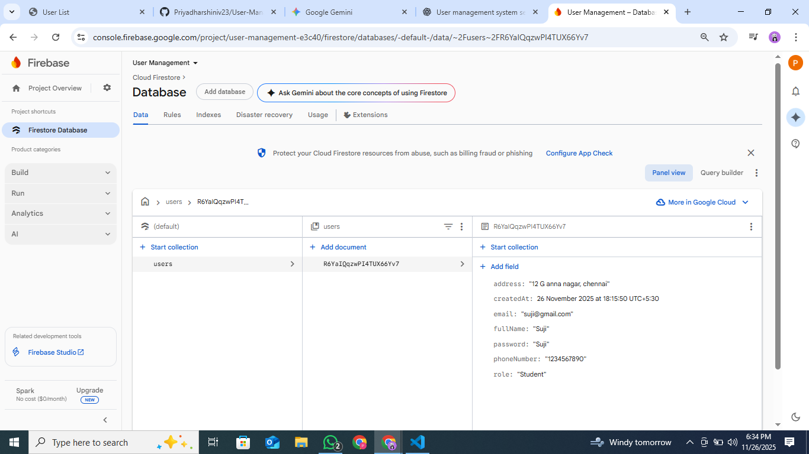

# 🎓 User Management System (UMS)

A simple full-stack User Management System where you can add, view, **update, and **delete user records (CRUD operations).  
The project uses a Node.js + Express backend, Firebase Firestore database, and a clean **HTML + Vanilla JavaScript + CSS frontend.

---

## ✅ Features

### ✔ Add Users  
Enter user details in the registration form (index.html).  
The data is validated on the client side (app.js) and securely stored in Firebase Firestore via a POST request.

### ✔ View Users  
Displays all registered users in a clean, comprehensive table (user-list.html).  
Fetches data via GET /api/users and shows Name, Email, Phone, Address, and Role.

### ✔ Update Users  
Edit user details using a modal/popup on the user list page.  
Saves updates through PUT /api/users/:id.

### ✔ Delete Users  
Delete user records instantly through DELETE /api/users/:id.

### ✔ REST API  
A complete CRUD API built using Express (server.js).  
Frontend communicates using Fetch API from app.js.

---

## 🛠 Components & Technologies

### Backend
- Node.js  
- Express.js  
- Firebase Admin SDK  
- Firestore Database  
- CORS Middleware  

### Frontend
- HTML  
- CSS  
- JavaScript (Vanilla JS)  
- Fetch API  

---

## 📁 Project Structure


user-management-system/
├── node_modules/          # Backend dependencies
├── server.js              # Express.js REST API (CRUD)
├── firebaseConfigure.js   # Firebase Admin SDK initialization
├── serviceAccountKey.json # Firebase credentials (DO NOT COMMIT)
├── package.json           # Backend dependencies
├── package-lock.json
├── index.html             # User registration page
├── user-list.html         # User list & management page
├── app.js                 # Frontend logic (API calls)
└── style.css              # Frontend styling


---                                                                                                                                          
##  Setup and Running the Backend                         
### 1.Install npm
```bash
npm install
```
### 2.Run Backend (Execute the main server file (index.js) using Node.js.)
```bash
node server.js
```
### 3.Server runs at Backend
```bash    
https://user-management-ozhy.onrender.com/api/users
```

